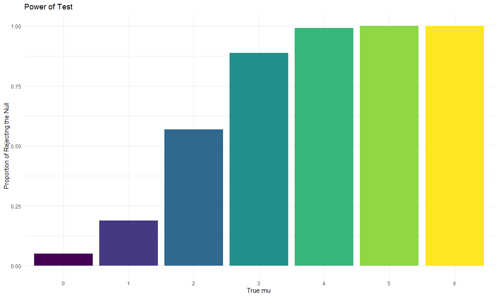
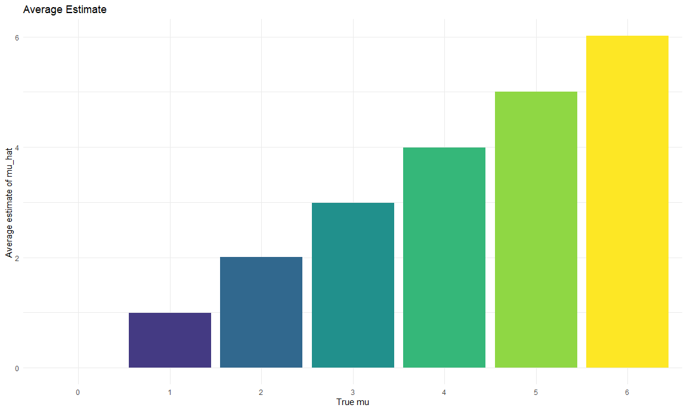
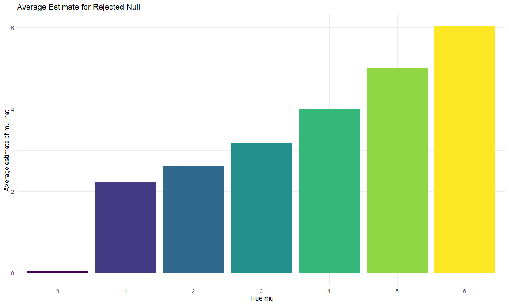

p8105\_hw5\_ww2579
================
Wenzhao Wu
11/10/2020

``` r
library(tidyverse)
```

    ## Warning: package 'tidyverse' was built under R version 4.0.3

    ## -- Attaching packages --------------------------------------- tidyverse 1.3.0 --

    ## v ggplot2 3.3.2     v purrr   0.3.4
    ## v tibble  3.0.3     v dplyr   1.0.2
    ## v tidyr   1.1.2     v stringr 1.4.0
    ## v readr   1.3.1     v forcats 0.5.0

    ## -- Conflicts ------------------------------------------ tidyverse_conflicts() --
    ## x dplyr::filter() masks stats::filter()
    ## x dplyr::lag()    masks stats::lag()

``` r
set.seed(1)

knitr::opts_chunk$set(
  fig.width = 12,
  fig.asp = .6,
  out.width = "90%"
)

theme_set(theme_minimal() + theme(legend.position = "bottom"))

options(
  ggplot2.continuous.colour = "viridis",
  ggplot2.continuous.fill = "viridis"
)

scale_colour_discrete = scale_colour_viridis_d
scale_fill_discrete = scale_fill_viridis_d
```

## Problem 1

Read in the data.

``` r
homicide_df = 
  read_csv("./homicide_data.csv") %>%
  mutate(
    city_state = str_c(city, state, sep = "_"),
    resolved = case_when(
      disposition == "Closed without arrest" ~ "unsolved",
      disposition == "Open/No arrest" ~ "unsolved",
      disposition == "Closed by arrest" ~ "solved")
  ) %>%
  select(city_state, resolved)
```

    ## Parsed with column specification:
    ## cols(
    ##   uid = col_character(),
    ##   reported_date = col_double(),
    ##   victim_last = col_character(),
    ##   victim_first = col_character(),
    ##   victim_race = col_character(),
    ##   victim_age = col_character(),
    ##   victim_sex = col_character(),
    ##   city = col_character(),
    ##   state = col_character(),
    ##   lat = col_double(),
    ##   lon = col_double(),
    ##   disposition = col_character()
    ## )

Let’s look at this a bit

``` r
aggregate_df = homicide_df %>%
  group_by(city_state) %>%
  summarize(
    hom_total = n(),
    hom_unsolved = sum(resolved == "unsolved")
  )
```

    ## `summarise()` ungrouping output (override with `.groups` argument)

Can I do a prop test for a single city?

``` r
prop.test(
  aggregate_df %>% filter(city_state == "Baltimore_MD") %>% pull(hom_unsolved),
  aggregate_df %>% filter(city_state == "Baltimore_MD") %>% pull(hom_total)) %>%
  broom::tidy()
```

    ## # A tibble: 1 x 8
    ##   estimate statistic  p.value parameter conf.low conf.high method    alternative
    ##      <dbl>     <dbl>    <dbl>     <int>    <dbl>     <dbl> <chr>     <chr>      
    ## 1    0.646      239. 6.46e-54         1    0.628     0.663 1-sample~ two.sided

Try to iterate

``` r
results_df = 
  aggregate_df %>%
  mutate(
    prop_tests = map2(.x = hom_unsolved, .y = hom_total, ~prop.test(x = .x, n = .y)), 
    tidy_tests = map(.x = prop_tests, ~broom::tidy(.x))
 ) %>%
  select(-prop_tests) %>%
  unnest(tidy_tests) %>%
  select(city_state, estimate, conf.low, conf.high)
```

    ## Warning: Problem with `mutate()` input `prop_tests`.
    ## i Chi-squared approximation may be incorrect
    ## i Input `prop_tests` is `map2(.x = hom_unsolved, .y = hom_total, ~prop.test(x = .x, n = .y))`.

    ## Warning in prop.test(x = .x, n = .y): Chi-squared approximation may be incorrect

## Problem 2

Read in data, tidy and iterate over all csv files.

``` r
tidy = function(y) {
  pivot_longer(
    data = y,
    week_1:week_8,
    names_to = "week",
    values_to = "value",
    names_prefix = "week_") %>%
  mutate(
    week = as.factor(week))
}

path_df = 
  tibble(path = list.files("./lda_data")) %>%
  mutate(path = str_c("lda_data/", path),
         data = map(.x = path, ~read_csv(.x)),
         tidied = map(.x = data, ~tidy(.x)),
         path = str_replace(path, "lda_data/exp_", "experiment "),
         path = str_replace(path, "lda_data/con_", "control "),
         path = str_replace(path, ".csv",""))
```

    ## Parsed with column specification:
    ## cols(
    ##   week_1 = col_double(),
    ##   week_2 = col_double(),
    ##   week_3 = col_double(),
    ##   week_4 = col_double(),
    ##   week_5 = col_double(),
    ##   week_6 = col_double(),
    ##   week_7 = col_double(),
    ##   week_8 = col_double()
    ## )
    ## Parsed with column specification:
    ## cols(
    ##   week_1 = col_double(),
    ##   week_2 = col_double(),
    ##   week_3 = col_double(),
    ##   week_4 = col_double(),
    ##   week_5 = col_double(),
    ##   week_6 = col_double(),
    ##   week_7 = col_double(),
    ##   week_8 = col_double()
    ## )
    ## Parsed with column specification:
    ## cols(
    ##   week_1 = col_double(),
    ##   week_2 = col_double(),
    ##   week_3 = col_double(),
    ##   week_4 = col_double(),
    ##   week_5 = col_double(),
    ##   week_6 = col_double(),
    ##   week_7 = col_double(),
    ##   week_8 = col_double()
    ## )
    ## Parsed with column specification:
    ## cols(
    ##   week_1 = col_double(),
    ##   week_2 = col_double(),
    ##   week_3 = col_double(),
    ##   week_4 = col_double(),
    ##   week_5 = col_double(),
    ##   week_6 = col_double(),
    ##   week_7 = col_double(),
    ##   week_8 = col_double()
    ## )
    ## Parsed with column specification:
    ## cols(
    ##   week_1 = col_double(),
    ##   week_2 = col_double(),
    ##   week_3 = col_double(),
    ##   week_4 = col_double(),
    ##   week_5 = col_double(),
    ##   week_6 = col_double(),
    ##   week_7 = col_double(),
    ##   week_8 = col_double()
    ## )
    ## Parsed with column specification:
    ## cols(
    ##   week_1 = col_double(),
    ##   week_2 = col_double(),
    ##   week_3 = col_double(),
    ##   week_4 = col_double(),
    ##   week_5 = col_double(),
    ##   week_6 = col_double(),
    ##   week_7 = col_double(),
    ##   week_8 = col_double()
    ## )
    ## Parsed with column specification:
    ## cols(
    ##   week_1 = col_double(),
    ##   week_2 = col_double(),
    ##   week_3 = col_double(),
    ##   week_4 = col_double(),
    ##   week_5 = col_double(),
    ##   week_6 = col_double(),
    ##   week_7 = col_double(),
    ##   week_8 = col_double()
    ## )
    ## Parsed with column specification:
    ## cols(
    ##   week_1 = col_double(),
    ##   week_2 = col_double(),
    ##   week_3 = col_double(),
    ##   week_4 = col_double(),
    ##   week_5 = col_double(),
    ##   week_6 = col_double(),
    ##   week_7 = col_double(),
    ##   week_8 = col_double()
    ## )
    ## Parsed with column specification:
    ## cols(
    ##   week_1 = col_double(),
    ##   week_2 = col_double(),
    ##   week_3 = col_double(),
    ##   week_4 = col_double(),
    ##   week_5 = col_double(),
    ##   week_6 = col_double(),
    ##   week_7 = col_double(),
    ##   week_8 = col_double()
    ## )
    ## Parsed with column specification:
    ## cols(
    ##   week_1 = col_double(),
    ##   week_2 = col_double(),
    ##   week_3 = col_double(),
    ##   week_4 = col_double(),
    ##   week_5 = col_double(),
    ##   week_6 = col_double(),
    ##   week_7 = col_double(),
    ##   week_8 = col_double()
    ## )
    ## Parsed with column specification:
    ## cols(
    ##   week_1 = col_double(),
    ##   week_2 = col_double(),
    ##   week_3 = col_double(),
    ##   week_4 = col_double(),
    ##   week_5 = col_double(),
    ##   week_6 = col_double(),
    ##   week_7 = col_double(),
    ##   week_8 = col_double()
    ## )
    ## Parsed with column specification:
    ## cols(
    ##   week_1 = col_double(),
    ##   week_2 = col_double(),
    ##   week_3 = col_double(),
    ##   week_4 = col_double(),
    ##   week_5 = col_double(),
    ##   week_6 = col_double(),
    ##   week_7 = col_double(),
    ##   week_8 = col_double()
    ## )
    ## Parsed with column specification:
    ## cols(
    ##   week_1 = col_double(),
    ##   week_2 = col_double(),
    ##   week_3 = col_double(),
    ##   week_4 = col_double(),
    ##   week_5 = col_double(),
    ##   week_6 = col_double(),
    ##   week_7 = col_double(),
    ##   week_8 = col_double()
    ## )
    ## Parsed with column specification:
    ## cols(
    ##   week_1 = col_double(),
    ##   week_2 = col_double(),
    ##   week_3 = col_double(),
    ##   week_4 = col_double(),
    ##   week_5 = col_double(),
    ##   week_6 = col_double(),
    ##   week_7 = col_double(),
    ##   week_8 = col_double()
    ## )
    ## Parsed with column specification:
    ## cols(
    ##   week_1 = col_double(),
    ##   week_2 = col_double(),
    ##   week_3 = col_double(),
    ##   week_4 = col_double(),
    ##   week_5 = col_double(),
    ##   week_6 = col_double(),
    ##   week_7 = col_double(),
    ##   week_8 = col_double()
    ## )
    ## Parsed with column specification:
    ## cols(
    ##   week_1 = col_double(),
    ##   week_2 = col_double(),
    ##   week_3 = col_double(),
    ##   week_4 = col_double(),
    ##   week_5 = col_double(),
    ##   week_6 = col_double(),
    ##   week_7 = col_double(),
    ##   week_8 = col_double()
    ## )
    ## Parsed with column specification:
    ## cols(
    ##   week_1 = col_double(),
    ##   week_2 = col_double(),
    ##   week_3 = col_double(),
    ##   week_4 = col_double(),
    ##   week_5 = col_double(),
    ##   week_6 = col_double(),
    ##   week_7 = col_double(),
    ##   week_8 = col_double()
    ## )
    ## Parsed with column specification:
    ## cols(
    ##   week_1 = col_double(),
    ##   week_2 = col_double(),
    ##   week_3 = col_double(),
    ##   week_4 = col_double(),
    ##   week_5 = col_double(),
    ##   week_6 = col_double(),
    ##   week_7 = col_double(),
    ##   week_8 = col_double()
    ## )
    ## Parsed with column specification:
    ## cols(
    ##   week_1 = col_double(),
    ##   week_2 = col_double(),
    ##   week_3 = col_double(),
    ##   week_4 = col_double(),
    ##   week_5 = col_double(),
    ##   week_6 = col_double(),
    ##   week_7 = col_double(),
    ##   week_8 = col_double()
    ## )
    ## Parsed with column specification:
    ## cols(
    ##   week_1 = col_double(),
    ##   week_2 = col_double(),
    ##   week_3 = col_double(),
    ##   week_4 = col_double(),
    ##   week_5 = col_double(),
    ##   week_6 = col_double(),
    ##   week_7 = col_double(),
    ##   week_8 = col_double()
    ## )

Make a spaghetti plot showing observations on each subject over time.

``` r
unnesting = 
  path_df %>%
  unnest(tidied)

lda_plot = unnesting %>%
  ggplot(aes(x = week, y = value, color = path, group = path)) +
  geom_point() +
  geom_line() +
  labs(title = "Con vs Exp over 8 weeks") +
  ggsave("lda_plot.pdf")
```

    ## Saving 12 x 7.2 in image

Comments: The graph above shows observations on each subject (10 for
control group, 10 for experimental group) over 8 weeks. It could be
observed that in general, subjects from the experimental group have
larger values of observation, compared to those from the control group.
As we can see from the graph, the longitudinal lines of the control
group are concentrated in the interval of -2.5 and 3.75; while the lines
of the experimental group are roughly between 0 and 7.5.

## Problem 3

t.test with one dataset

``` r
set.seed(1)
samp = rnorm(30,1,5)
t.test(samp) %>%
  broom::tidy()
```

    ## # A tibble: 1 x 8
    ##   estimate statistic p.value parameter conf.low conf.high method     alternative
    ##      <dbl>     <dbl>   <dbl>     <dbl>    <dbl>     <dbl> <chr>      <chr>      
    ## 1     1.41      1.67   0.105        29   -0.313      3.14 One Sampl~ two.sided

iterate one-sample t.test with 5000 datasets for different μ’s

``` r
n = 30
mu = 0
sigma = 5
set.seed(1)


sim = function(n = 30, mu, sigma = 5) {
  samp = tibble(
    x = rnorm(n, mean = mu, sd = sigma))
  samp %>%
    t.test(conf.level = 0.95, formula = samp~1) %>%
    broom::tidy()}


sim_results = tibble(true_mu = c(0,1,2,3,4,5,6)) %>%
  mutate(test_output = 
           map(.x = true_mu, ~rerun(5000, sim(mu = .x))))
```

Testing the function `sim` when mu = 6

``` r
sim(mu = 6)
```

    ## # A tibble: 1 x 8
    ##   estimate statistic   p.value parameter conf.low conf.high method   alternative
    ##      <dbl>     <dbl>     <dbl>     <dbl>    <dbl>     <dbl> <chr>    <chr>      
    ## 1     6.71      7.87   1.11e-8        29     4.96      8.45 One Sam~ two.sided

Make a plot showing the proportion of times the null was rejected (the
power of the test).

``` r
t_test = unnest(unnest(sim_results)) %>%
  mutate(true_mu = as.factor(true_mu))
```

    ## Warning: `cols` is now required when using unnest().
    ## Please use `cols = c(test_output)`
    
    ## Warning: `cols` is now required when using unnest().
    ## Please use `cols = c(test_output)`

``` r
power_plot = 
  t_test %>%
  filter(p.value < 0.05) %>%
  group_by(true_mu) %>%
  summarise(n_power = n()) %>%
  mutate(power = n_power/5000) %>%
  ggplot(aes(x = true_mu, y = power, fill = true_mu)) +
  geom_col() +
  theme(legend.position = "none") +
  labs(title = "Power of Test",
       x = "True mu",
       y = "Proportion of Rejecting the Null") +
  ggsave("power_plot.pdf")
```

    ## `summarise()` ungrouping output (override with `.groups` argument)

    ## Saving 12 x 7.2 in image

``` r
power_plot
```



Power and effect size are positively associated. Specifically, effect
size here is the difference in μ (true μ - hypothesized μ). Since the
hypothesized μ is 0, the effect size equals to the value of true μ. As
we can see from the graph, the power increases along with the μ, and it
reaches to 1 when μ equals to 5 or greater.

Make a plot showing the average estimate of μ^.

``` r
avg_estimate = 
  t_test %>%
  group_by(true_mu) %>%
  summarise(avg_estimate = mean(estimate))
```

    ## `summarise()` ungrouping output (override with `.groups` argument)

``` r
avg_estimate_plot = 
  avg_estimate %>%
  ggplot(aes(x = true_mu, y = avg_estimate, fill = true_mu, group = true_mu)) +
  geom_col() +
  theme(legend.position = "none") +
  labs(title = "Average Estimate",
       x = "True mu",
       y = "Average estimate of mu_hat ")

avg_estimate_plot
```



Make a second plot the average estimate of μ^ only in samples for which
the null was rejected

``` r
power_avg_estimate = 
  t_test %>%
  filter(p.value < 0.05) %>%
  group_by(true_mu) %>%
  summarise(power_avg_estimate = mean(estimate))
```

    ## `summarise()` ungrouping output (override with `.groups` argument)

``` r
power_avg_estimate_plot = 
  power_avg_estimate %>%
  ggplot(aes(x = true_mu, y = power_avg_estimate, fill = true_mu)) +
  geom_col() +
  theme(legend.position = "none") +
  labs(title = "Average Estimate for Rejected Null",
       x = "True mu",
       y = "Average estimate of mu_hat ")

power_avg_estimate_plot
```



The graph shows the values of the average estimates of μ^ only in
samples for which the null was rejected. As the true μ increases from 1
to 6, the average estimate of μ^ gets closer to the true μ. This is
because more samples for which the null was rejected are included with
larger μ, which makes the average more approximately equal to the true
μ.
